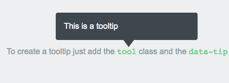
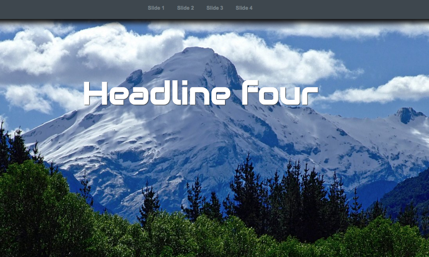
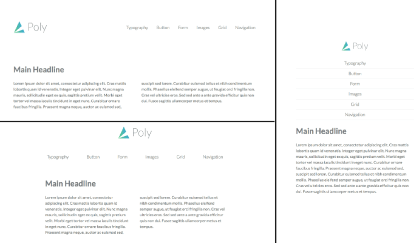

# web-workspace
Code (snippets) about HTML / CSS / JavaScript and other web related stuff.

* [**css-tooltips**](css-tooltips) : smoothly easy reusable tooltips made with pure css 

------------------
* [**css-fullscreen-slider**](css-fullscreen-slider) : pure css image slider gallery with effects 

------------------
* [**css-responsive-nav**](css-responsive-nav) : a responsive website navigation, using CSS media queries and flexbox layout. 

