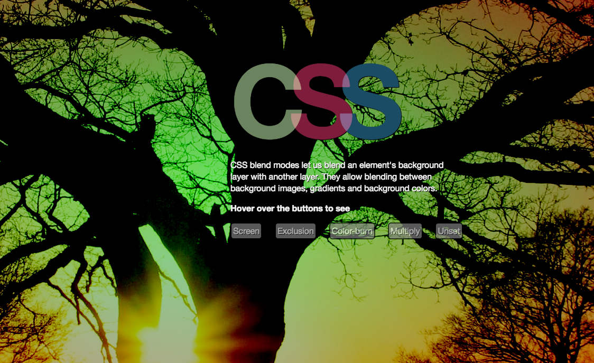

# Pure CSS Blending
<p>CSS Blending lets us use "photoshop like" blending filters in the browser. 
This can create some really interesting effects, especially when combined with
gradients and multiple stacked background pictures and colors.</p>
<p>Hover over the buttons in ```index.html``` to see some blending in action</p>
 
 
### Targeting the buttons
```javascript
<script>
		const buttons = document.getElementsByClassName("button");
		for (let button of buttons) {
			button.addEventListener("mouseover", (event) => {
				document.getElementsByTagName('body')[0].style.backgroundBlendMode = event.target.innerHTML.toLowerCase();
			})
		}	
</script>
```


